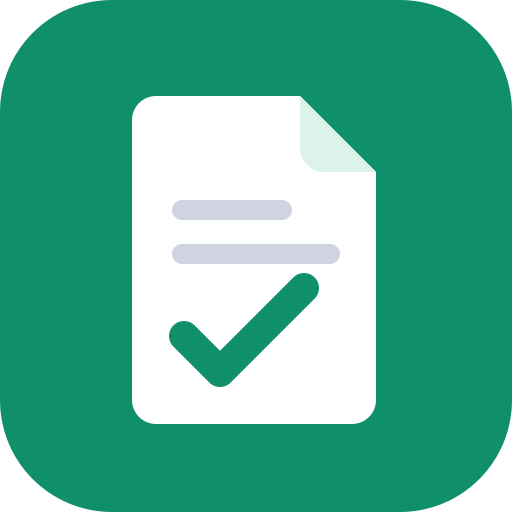

# PaperPorter

PaperPorter fills official PDF forms, such as city building permits, planning applications, business licenses, and food truck permits, in their original layout. Ask your assistant to find a form, answer its questions in conversation, check the answers, and download the completed PDF ready to sign and submit.

## What it does

- Searches a catalog of reviewed official forms by city, agency, or form name.
- Lists each form's questions, including choices, dates, and conditional sections.
- Saves your answers as a private draft, validates them, and shows them to you for confirmation.
- Generates the filled PDF only after you confirm, and returns a download link that expires after 15 minutes.

PaperPorter never fills signatures and never submits forms for you.

## What this plugin contains

- **MCP server:** connects to the PaperPorter server at `https://paperporter.com/mcp` over HTTPS. You sign in with a PaperPorter account through OAuth the first time a tool needs it.
- **Skill:** `fill-pdf-form`, which guides the assistant through finding a form, collecting answers, validating, and generating the PDF.

The plugin does not run local code, read files on your computer, or send data anywhere other than the PaperPorter server.

## Getting started

1. Install the plugin.
2. Ask: "Find the Danville building permit application and help me fill it out."
3. Sign in or create a free PaperPorter account when prompted.

Browse ready forms at https://paperporter.com/permits.

## Privacy Policy

PaperPorter stores your account username, a salted password hash, and the answers and PDFs for applications you create. Applications are kept until you delete them. PaperPorter does not sell personal information or use your answers to train AI models. Hosting is provided by Cloudflare. Read the full policy at https://paperporter.com/privacy.

## Support

Email support@paperporter.com or visit https://paperporter.com/support. Terms of service: https://paperporter.com/terms.
